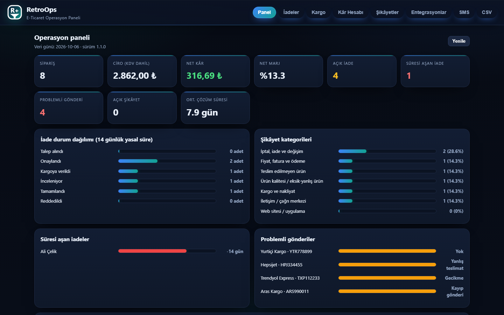
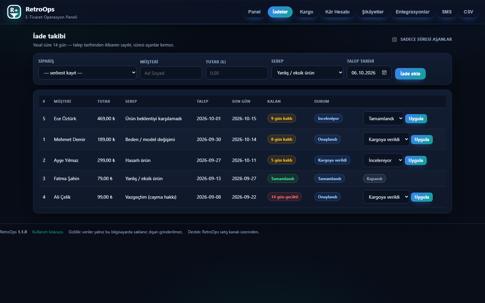
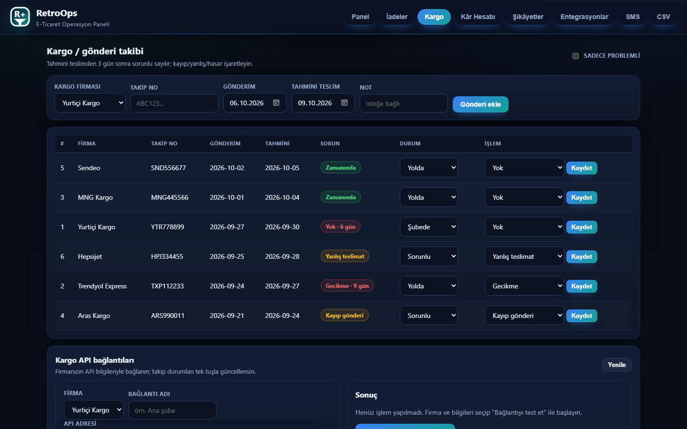
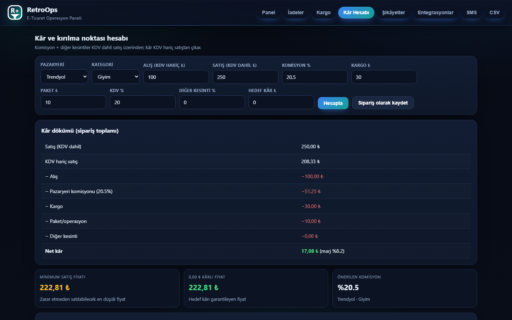
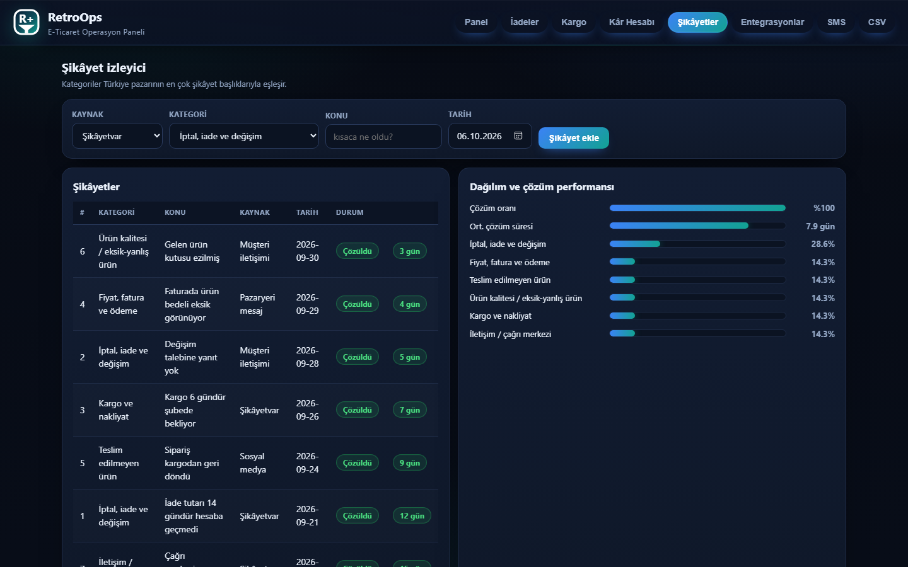
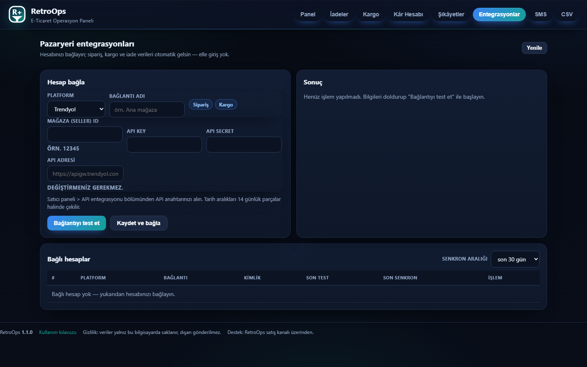
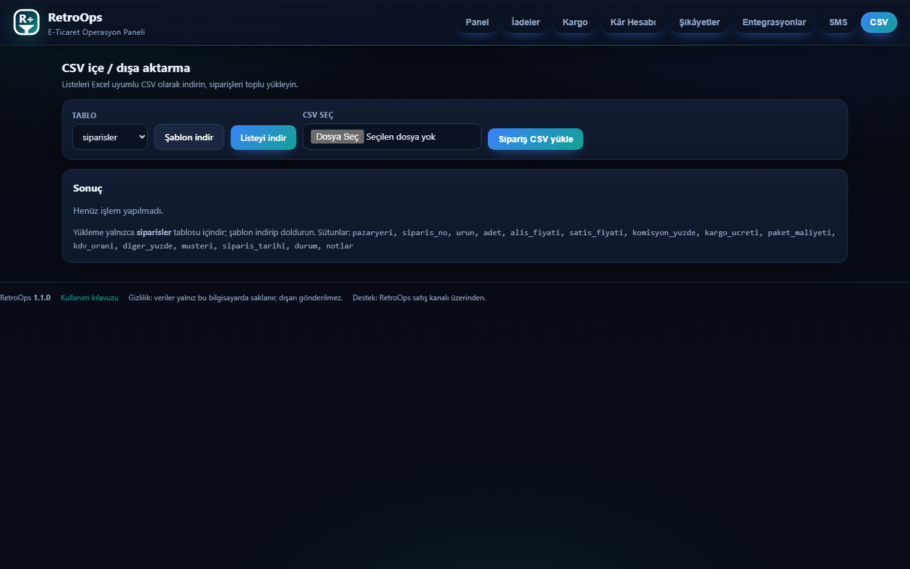
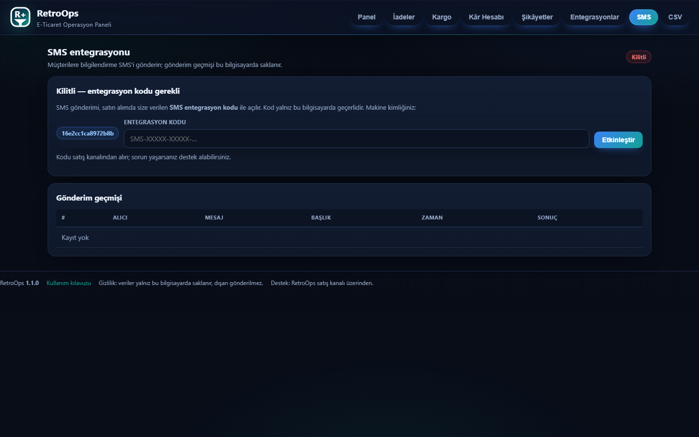
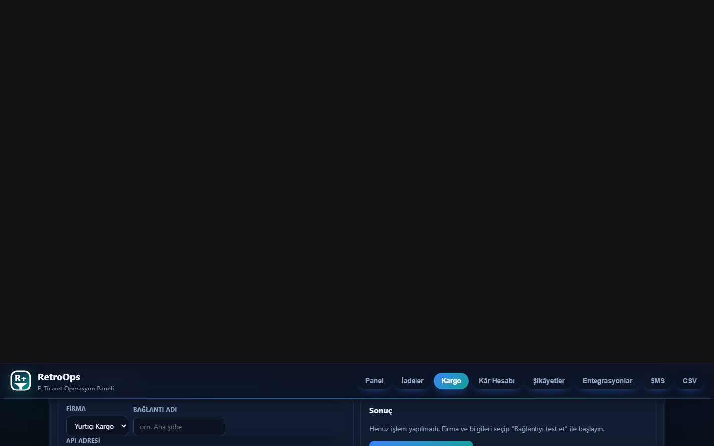

# RetroOps · E-Ticaret Operasyon Paneli

> **EN:** Free Windows desktop app for Turkish e-commerce operations — returns
> tracking, shipping-issue board, profit & break-even calculator, complaint
> monitor and marketplace integrations. 14-day trial, license key afterwards.

**İade takibi, kargo problem panosu, kâr/kırılma noktası hesabı, şikâyet
izleyici ve pazaryeri entegrasyonları** — hepsi tek, sade bir panelde.
Windows için hazırlanmış masaüstü uygulamasıdır; **Python, kurulum sihirbazı
veya teknik bilgi gerekmez.**

> Bu depo yalnızca **hazır programın yayınlandığı** depodur: kaynak kod açık
> değildir, değiştirilemez ve yeniden dağıtılamaz. Program ücretsiz
> **14 gün denenebilir**; süresi dolunca satış kanalından alınan lisans
> anahtarıyla çalışmaya devam eder.

## İndirme

➡️ **[Releases sayfasından en son sürümü indirin](https://github.com/RetroNyym/RetroOps/releases)**

Paket tek dosyadır: `RetroOps.exe` her şeyin içine gömülmüştür; ek DLL,
kütüphane veya çerçeveler gerekmez. Paket içinde ayrıca kullanım kılavuzu
(`KILAVUZ.md`) bulunur.

## Kurulum (2 dakika)

1. `RetroOps-vX.Y.Z.zip` dosyasını bir klasöre çıkarın — ya da zip'i hiç
   açmadan **zippeden doğrudan** `RetroOps.exe`'ye çift tıklayın.
2. **RetroOps masaüstü penceresi** açılır (tarayıcı değil; adres çubuğu yok).
   İkon RetroOps **R+** logosudur.
3. Hiçbir ayar gerekmez: deneme otomatik başlar, ilk ekranda size hangi
   adımı atacağınız söylenir.
4. **Entegrasyonlar** sekmesinden hesaplarınızı bağlayın → **Test** →
   **Senkronize et**. **Kargo** ve **SMS** sekmelerinden de bağlantılarınızı
   kurabilirsiniz.

> **Windows SmartScreen/Defender uyarısı** çıkarsa: *Daha fazla bilgi* →
> *Yine de çalıştır*. Program imzasızdır; bu, yeni dağıtılan uygulamalarda
> normal bir uyarıdır.

**Sistem gereksinimleri:** Windows 10 veya 11 (64 bit), internet bağlantısı.
Başka hiçbir şey gerekmez.

## Ekran görüntüleri

| Panel | İadeler |
|---|---|
|  |  |

| Kargo | Kâr hesabı |
|---|---|
|  |  |

| Şikâyetler | Entegrasyonlar |
|---|---|
|  |  |

| CSV yükleme/dışa aktarma | SMS entegrasyonu |
|---|---|
|  |  |

| Kargo API bağlantıları |
|---|
|  |

## Ne yapar?

| Bölüm | İşlev |
|---|---|
| **Panel** | Ciro, net kâr, marj, açık/geciken iade, problemli gönderi ve şikâyet kartları; KDV'li satış listesi |
| **İadeler** | 14 günlük yasal süre sayacı ve `talep → onay → inceleme → tamamlandı` durum akışı |
| **Kargo** | Gönderi + takip no, otomatik gecikme uyarısı, sorun işaretleme, **kargo firması API** bağlantısı ile otomatik durum güncelleme |
| **Kâr Hesabı** | Komisyon + kargo + paket + KDV ile net kâr; kırılma noktası ve hedefli fiyat |
| **Şikâyetler** | Kayıt, çözüm oranı ve ortalama çözüm süresi |
| **Entegrasyonlar** | Trendyol, Hepsiburada, N11, ÇiçekSepeti, Shopier, Pazarama, Shopify, WooCommerce, Amazon bağlantıları; şifreli saklama, test ve senkronizasyon |
| **CSV** | Excel uyumlu indirme, şablon, toplu sipariş yükleme |
| **SMS** | Netgsm ile bilgilendirme SMS'i (aktivasyon kodu ile açılır) |

## Lisans ve kullanım

- **İlk 14 gün ücretsiz** ve kayıt gerektirmez.
- Süre dolunca program lisans anahtarı ister: `Panel → Lisans` alanına
  yazdığınızda devam eder. Anahtar **yalnızca aldığınız bilgisayarda**
  çalışır.
- Program yalnız bu bilgisayar üzerinde çalışır; verileriniz
  `data\ops.db` dosyasında **sadece sizin makinenizde** tutulur.
- Ayrıntılar için [`LICENSE.txt`](LICENSE.txt) ve
  [`KILAVUZ.md`](KILAVUZ.md) dosyalarına bakın.

## Destek

Sorularınız ve lisans talepleriniz için **RetroOps satış kanalı** ile
iletişime geçin. Sorun bildirirken makine kimliğinizi (Panel → Lisans) ve
program sürümünü (Panel altbilgisi) ekleyin.

---

*Telif © 2026 RetroOps. Tüm hakları saklıdır. Kaynak kod açık değildir;
kopyalanamaz, değiştirilemez, yeniden yayınlanamaz ve ticari olarak
kullanılamaz.*
